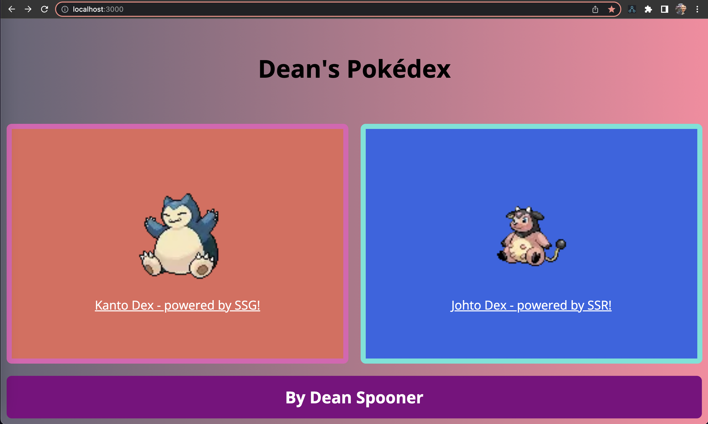
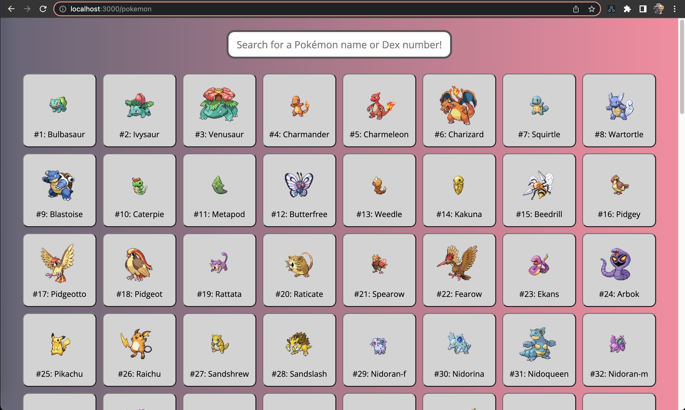
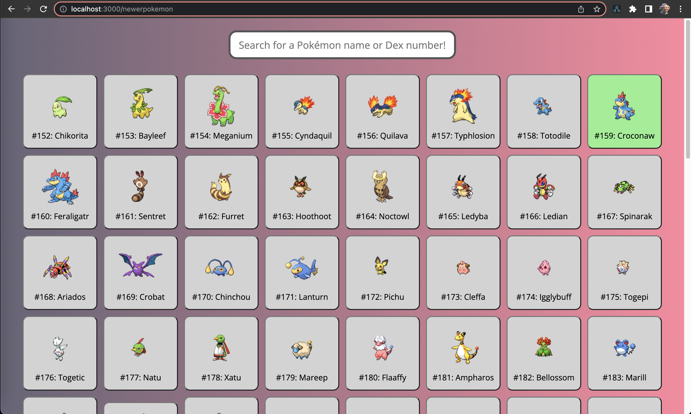
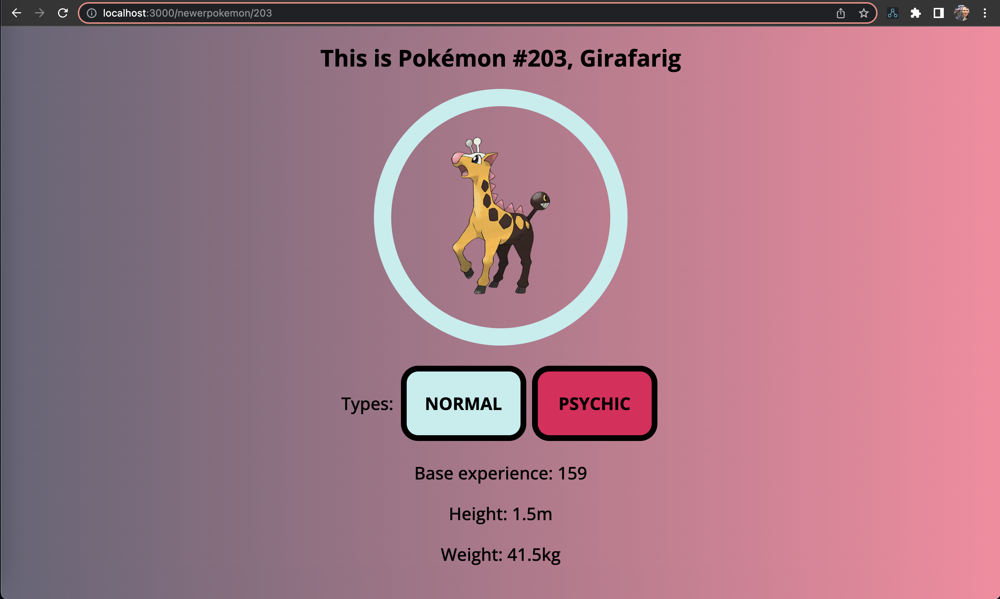
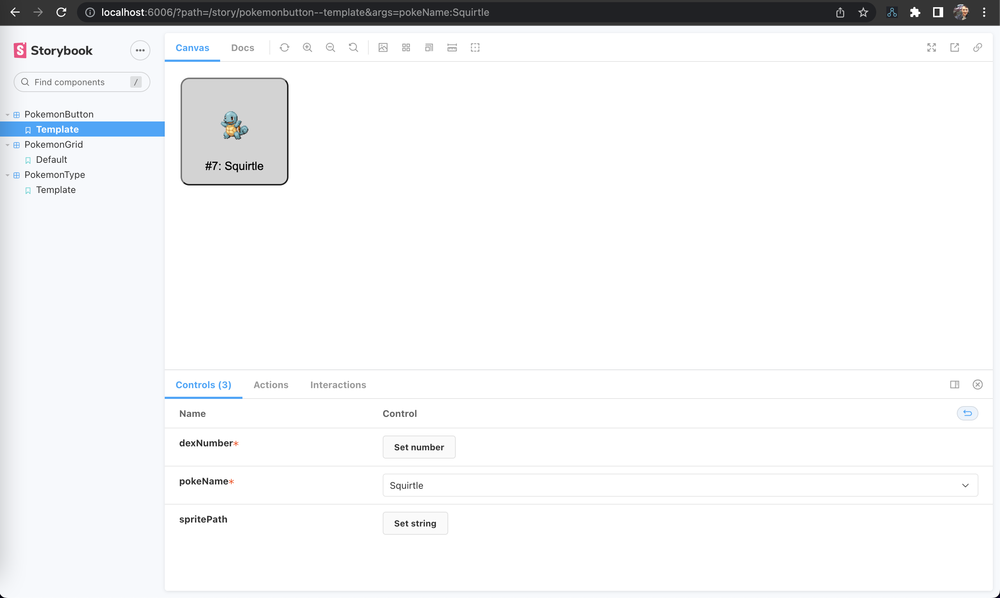
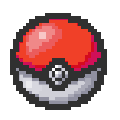

# The Pokédex Project - by [Dean Spooner](https://github.com./DeanSpooner)

This is a simple site that uses the [PokéAPI](https://pokeapi.co/), a RESTful Pokémon API, to display information about different Pokémon.

## Tech Stack

This project was built using:

- React;
- Next.js;
- TypeScript;
- Storybook;
- Styled Components;
- Jest.

## Running the site locally

To run the site locally, clone down this repo, then in your terminal, run the following commands:

`npm install` 
`npm run dev`

A local instance will now run on [http://localhost:3000](http://localhost:3000).

### Static-site generation

The Pokémon detail pages of the Kanto Pokédex are created using the static-site generation feature of Next.js; these pages can be seen by navigating through the Kanto Pokédex, or using the route `/pokemon/[pokemonId]`, with pokemonIds from 1 to 151 available to view.

### Server-side rendering

The Pokémon detail pages of the Johto Pokédex are created using the server-side rendering feature of Next.js; these pages can be seen by navigating through the Johto Pokédex, or using the route `/newerpokemon/[pokemonId]`, using any Pokémon's ID number to view.

## Running Storybook locally

To run the Storybook locally, clone down this repo, then in your terminal, run the following commands:

`yarn storybook`

A local instance will now run on [http://localhost:6006](http://localhost:6006).

## Running tests locally

To run the tests locally, clone down this repo, then in your terminal, run the following command:

`npm test`

The test suites will now run from your local repo.

# By [Dean Spooner](https://github.com./DeanSpooner) 
